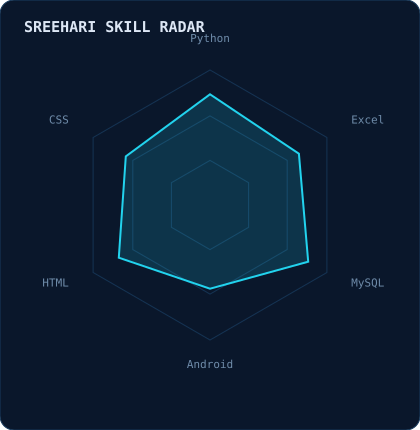
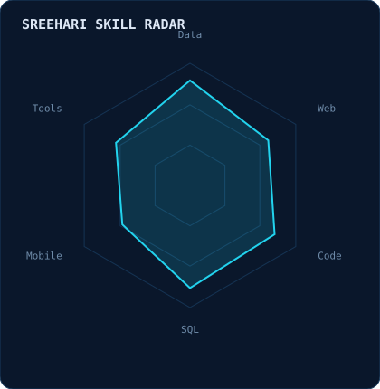
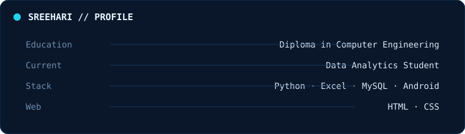
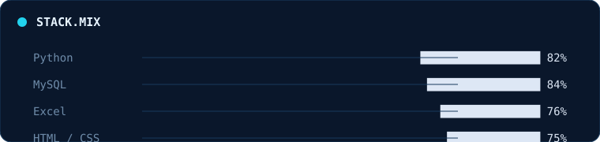

<!-- Sreehari animated terminal banner — HUMBLE-style layout. Original portrait colors are preserved. -->
<picture>
  <source media="(prefers-color-scheme: dark)" srcset="assets/banner-dark.v1.svg">
  <source media="(prefers-color-scheme: light)" srcset="assets/banner-light.v1.svg">
  
</picture>

 

 

&nbsp;&nbsp;
&nbsp;&nbsp;
&nbsp;&nbsp;

---

## This is me :)

Hi, I'm **Sreehari K**, a **Data Analytics student** with a completed **Diploma in Computer Engineering**.

- 🎓 Diploma in **Computer Engineering** — completed.
- 📊 Currently studying **Data Analytics**.
- 🐍 Working with **Python**.
- 📑 Learning and using **Excel** for data work.
- 🗄️ Working with **MySQL**.
- 📱 Learning **Android** development.
- 🌐 Building with **HTML & CSS**.
- 🚀 I like learning, building and improving my technical skills.

 

## my perfect stack`

---

## signals

<table>
<tr>
<td width="50%" align="center" valign="middle">

<picture>
  <source media="(prefers-color-scheme: dark)" srcset="assets/radar-dark.svg">
  <source media="(prefers-color-scheme: light)" srcset="assets/radar-light.svg">
  
</picture>

</td>
<td width="50%" align="center" valign="middle">

<picture>
  <source media="(prefers-color-scheme: dark)" srcset="assets/radar-langs-dark.svg">
  <source media="(prefers-color-scheme: light)" srcset="assets/radar-langs-light.svg">
  
</picture>

</td>
</tr>
</table>

---

## Numbers matter? ohhh yes.

<picture>
  <source media="(prefers-color-scheme: dark)" srcset="assets/card-stats-dark.svg">
  <source media="(prefers-color-scheme: light)" srcset="assets/card-stats-light.svg">
  
</picture>

 

---

## 📫 Contact

**ksreehari983@gmail.com**

  

` Build by HUMBLE `

